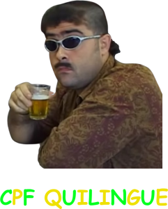

Software de cunho técnico-cultural sobre a arte milenar do "foi sem querer" aplicado à computação tupiniquim moderna.

Este repositório documenta um programa de computador dedicado ao estudo antropológico da [cultura quilingue](https://www.youtube.com/watch?v=K4-MOTxwaM0) digital, onde pequenos desvios numéricos, ajustes milimétricos e arredondamentos morais produzem CPFs falsos porém validáveis (e verossímeis), aptos a sobreviver a formulários invasivos, sistemas preguiçosos e atendentes em final de expediente.

---

💭 Introdução Filosófica

Em um país mulambo que sobrevive à base de formuários invasivos e campos obrigatórios que ninguém confere, nasce o CPF QUILINGUE: uma ferramenta que honra a tradição do “opa, digitei errado”, aplicada com rigor matemático, precisão algorítmica e um pouquinho de falcatrua.

Aqui, o erro não é bug. É feature cultural.

---

🚩 O Problema

Você precisa fornecer seu CPF para algum tipo de cadastro. Mas seu instinto de pilantragem não te deixa usar seu CPF verdadeiro.

Você precisa de um número que:
- ✅ Seja diferente do original (para não dar pala com seu CPF verdadeiro);
- ✅ Seja **fácil de lembrar** (porque ninguém decora 11 dígitos aleatórios);
- ✅ Seja **verossímil** (para parecer erro honesto de digitação);
- ✅ Passe na validação matemática (checksum correto).

É aí que entra a mágica.

O CPF QUILINGUE resolve isso gerando variações mínimas de um CPF real:
- Troca poucos dígitos (um, dois, ou três, dependendo da audácia);
- **Mantém 8-10 dígitos idênticos ao original** (fácil de memorizar!);
- Recalcula os dígitos verificadores com total respeito à matemática;
- Produz CPFs que:
  - passam em validações automáticas;
  - falham apenas sob investigação profunda;
  - permitem a clássica defesa: "nossa, juro que não vi" (funciona desde 1500🇧🇷).

O grande diferencial do CPF QUILINGUE não é o número. É a narrativa e a praticidade que facilitam a vida do malandro.

---

⚙️ Como Funciona (em termos técnicos e morais)

O algoritmo segue a fórmula consagrada:

```
CPF_QUILINGUE = OPORTUNIDADE
               + UM_POUQUINHO_DE_FALCATRUA
               + CHECKSUM_CORRETO
```

Etapas:
1. Recebe um CPF válido (de preferência não o seu);
2. Começa tentando alterar apenas **1 dígito**:
   - Testa todas as 11 posições possíveis;
   - Para cada posição, testa os 9 dígitos diferentes do original;
   - Valida matematicamente cada candidato;
3. Se não encontrar nada com 1 dígito, tenta com **2 dígitos**:
   - Gera todas as combinações de 2 posições (55 combinações);
   - Para cada combinação, testa todas as variações possíveis (81 por combinação);
4. Se ainda assim não encontrar, parte para **3 dígitos**:
   - Gera todas as combinações de 3 posições (165 combinações);
   - Para cada combinação, testa todas as variações possíveis (729 por combinação);
5. Para em qualquer etapa que encontre resultados válidos (economia de tentativas);
6. Exibe progressivamente cada CPF válido encontrado, indicando quantos dígitos diferem do original.

Por fim, o usuário possui diversas variações do CPF original, prontas para uso administrativamente ambíguo.

---

🚨 Aviso Legal Importantíssimo

Este software é:
- um experimento humorístico;
- uma sátira cultural;
- uma peça de ficção etnográfica computacional;

Qualquer semelhança com práticas reais é mera coincidência, herança colonial ou culpa do usuário.

O autor (seja lá quem for) não se responsabiliza por:
- cadastros aceitos;
- sistemas mal feitos;
- olhares desconfiados;
- frases começando com “senhor, só um minutinho”.

Se for pego, negue com educação. E na pior das hipóteses, o problema é todo seu.

---

🤖 Disclaimer Técnico-Existencial

Este código foi **vibe-codado** com auxílio sem-vergonha de inteligência artificial.

Se você está lendo o código e pensando "isso parece que foi escrito por alguém que não sabe direito o que está fazendo mas funcionou", parabéns: você entendeu o espírito do projeto.

O código funciona. Não pergunte por quê. Não pergunte como. Apenas aceite, como o atendente do banco aceitaria "ops, digitei errado".

---

🤡 Considerações Finais

A cultura quilingue não se aprende. Ela se herda.

O código é vibe. A execução é meme. O resultado é arte.